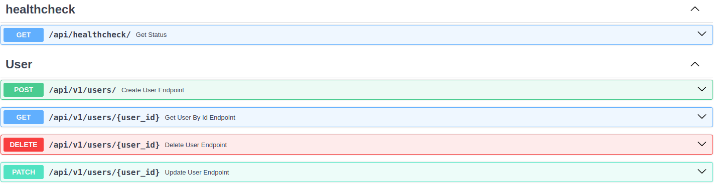

# User Service

 Simple CRUD Web API that follows CQRS and Mediator patterns.



## Endpoints

#### GET /healthcheck/
```bash
curl -X "GET" "http://localhost:5000/api/healthcheck/"
```
```json
{"status": "ok"}
```

#### POST /api/v1/users/

```bash
curl -X 'POST' \
  'http://0.0.0.0:5000/api/v1/users/' \
  -H 'accept: application/json' \
  -H 'Content-Type: application/json' \
  -d '{
  "email": "mymail@gmail.com",
  "phone": "+0000000",
  "hashed_password": "strongpassword"
}'
```
```json
{
  "id": 1,
  "email": "mymail@gmail.com",
  "phone": "+0000000",
  "hashed_password": "$2b$12$h/bkjN5WRJiBO6tTr/Ju1uDEiREZ0eBVb4e4EF8sIUSLkTN.WDCuC"
}
```

#### GET api/v1/users/
```bash
curl -X "GET" "http://0.0.0.0:5000/api/v1/users/1"
```
```json
{
  "id": 1,
  "email": "mymail@gmail.com",
  "phone": "+0000000",
  "hashed_password": "$2b$12$h/bkjN5WRJiBO6tTr/Ju1uDEiREZ0eBVb4e4EF8sIUSLkTN.WDCuC"
}
```

#### DELETE api/v1/users/
```bash
curl -X 'DELETE' \
  'http://0.0.0.0:5000/api/v1/users/1' \
  -H 'accept: application/json'
```
```json
{
  "id": 1,
  "email": "mymail@gmail.com",
  "phone": "+0000000",
}
```

## Dependencies

### Infrastructure

- [Postgres](https://www.postgresql.org/docs/current/index.html) — Database
- [Docker](https://docs.docker.com/) — For deployment


###  Key python libs

- [FastAPI](https://fastapi.tiangolo.com/) — Async web framework
- [SQLAlchemy 2.0](https://docs.sqlalchemy.org/en/20/) — ORM for working with database
- [Alembic](https://alembic.sqlalchemy.org/en/latest/) — Database schema migration tool

### TODO

- [ ] Write tests
- [ ] Add Exceptions handlers